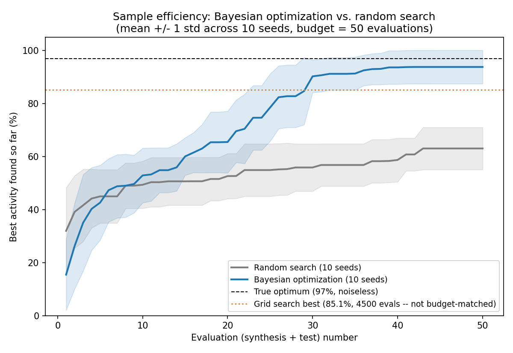
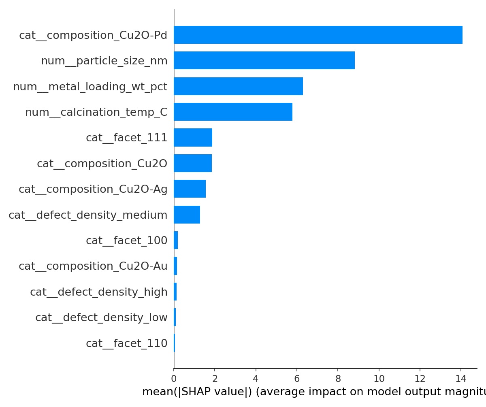
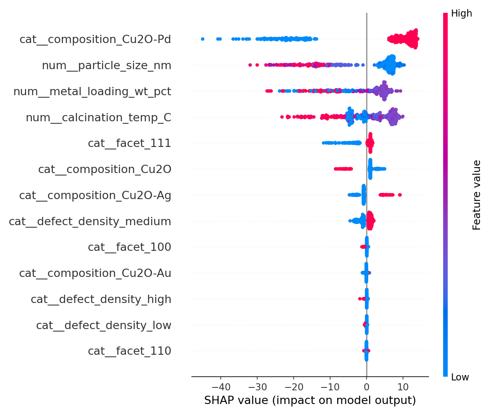

# CatalystBO

**Closed-loop Bayesian optimization for photocatalyst discovery.** Given a
mixed categorical/continuous design space (composition, particle size,
metal loading, facet, calcination temperature, defect density), this repo
doesn't predict the activity of catalysts you already made — it recommends
the *next* catalyst to synthesize, using a Gaussian Process surrogate and
Expected Improvement to decide where testing is most likely to help.

> Imagine you've synthesized Cu2O, Cu2O-Pd, Cu2O-Au, Cu2O-Ag catalysts.
> Instead of guessing candidate #301, the model says: **Cu2O-Pd, 20 nm,
> 2.07 wt% Pd, facet (111), 359°C calcination, medium defect density →
> 98.3% predicted activity.** That's the closed loop this repo builds.

Part of a three-repo portfolio demonstrating ML applied to catalysis
research: [`CatalystML`](https://github.com/teja2792/CatalystML) (property
prediction), [`ExplainableCatML`](https://github.com/teja2792/ExplainableCatML)
(cross-method explainability), and this repo (sequential experimental
design). This one is the only one of the three that decides what to test
next rather than explaining a fixed dataset.

---

## Results

### Sample efficiency (10 seeds, budget = 50 evaluations each)

| Method | Final regret (mean ± std) | Evaluations |
|---|---|---|
| Random search | 33.9 ± 7.6 | 50 |
| Bayesian optimization | **3.2 ± 6.0** | 50 |
| Grid search (context only, not budget-matched) | 11.9 (single run) | 4,500 |

BO reduced mean regret by ~91% relative to random search at equal budget,
and beat a grid search using 90x fewer evaluations.

### What the optimizer's evidence says matters

A RandomForest trained on all 500 (candidate, activity) pairs BO evaluated
across 10 seeds (test R² = 0.971, held-out from a 400/100 split) confirms
composition dominates, consistent with it being the most strongly-grounded
effect in the oracle:

### Demo: recommend the next candidate